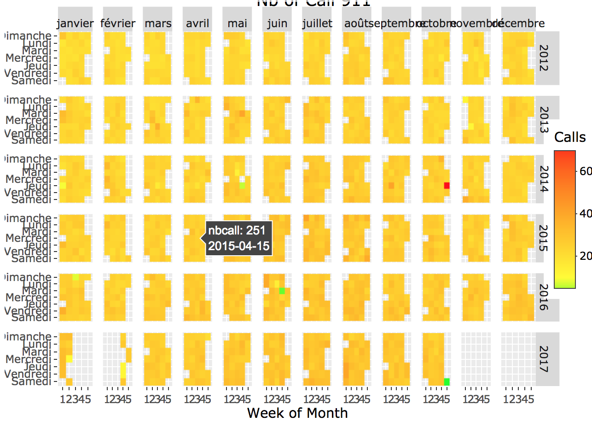

# Let's code

## Get the code to draw the following charts  

 

<table border="0" cellpadding="100">
<tr>
	<td></td>
	<td></td>
	<td></td>	<td></td>
	<td></td>
</tr>
<tr> </tr>
<tr>
	<td></td>
	<td></td>
	<td></td>	<td></td>
	<td></td>
</tr>
<tr></tr>
<tr>
	<td></td>
	<td></td>
	<td></td>	<td></td>
	<td></td>
</tr>
<tr></tr>
<tr>
	<td></td>
	<td></td>
	<td></td>	<td></td>
	<td></td>
</tr>
<tr></tr>
<tr>
	<td></td>
	<td></td>
	<td></td>	<td></td>
	<td></td>
</tr>
<tr></tr>

</table>